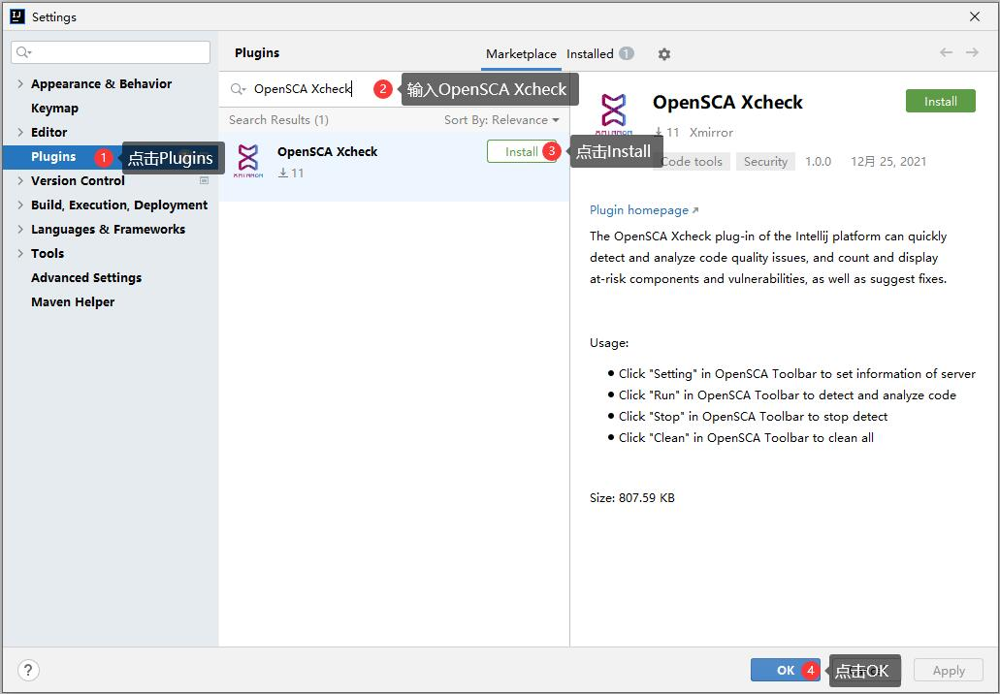
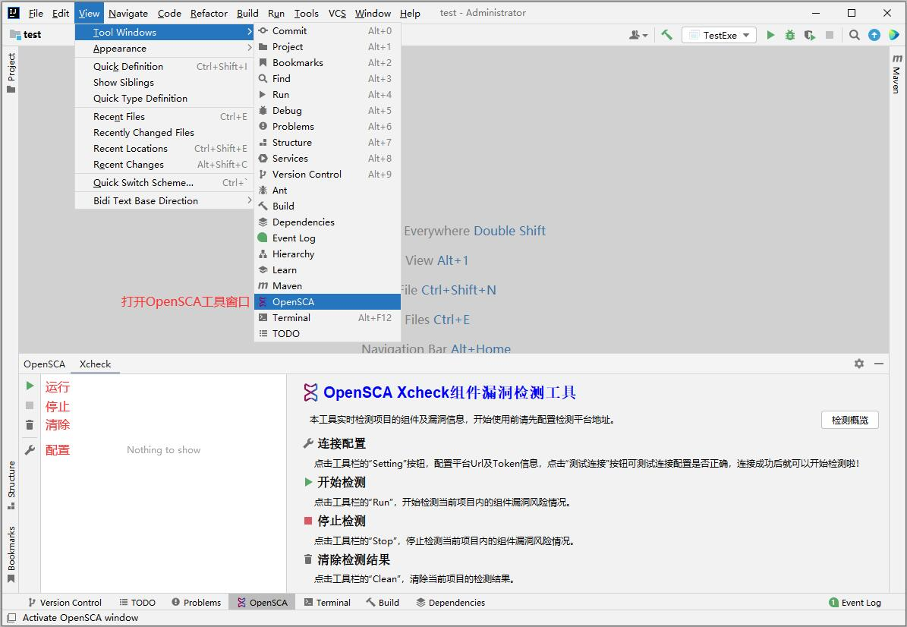

# IDEA插件使用

## 安装插件

- 安装方法一：在[适配的IDE](https://plugins.jetbrains.com/plugin/18246-opensca-xcheck#:~:text=Code%20tools%2C%20Security-,Product%20Compatibility,-Determined%20by%20plugin)中通过插件市场安装（推荐）

  以IntelliJ IDEA为例：在IDE中依次点击“File|Settings|Plugins|Marketplace”，在搜索框中输入“OpenSCA Xcheck”，点击“Install”

- 安装方法二：访问[OpenSCA插件中心](https://opensca.xmirror.cn/pages/plug-in)下载插件并安装

  以IntelliJ IDEA为例：将下载下来的插件安装包拖入适配的IDE中即可

- 安装方法三：从[GitHub](https://github.com/XmirrorSecurity/OpenSCA-intellij-plugin)或 [Gitee ](https://gitee.com/XmirrorSecurity/OpenSCA-intellij-plugin)下载源码自行编译安装

  使用IntelliJ IDEA打开下载到本地的源码，需要配置运行环境：`jDK11`，待Gradle导入依赖和插件，执行`intellij`插件的`buildPlugin`任务（Gradle|Tasks|intellij|buildPlugin），构建的安装包存在于当前项目下*build/distributions*目录下，将此目录下的安装包拖入当前IDE中即可

## 使用插件

### 插件功能

- 配置：在File|Settings|Other Settings|OpenSCA Setting中或者点击OpenSCA面板里左侧工具栏中的`Setting`按钮可配置访问的服务器url（https://opensca.xmirror.cn）和token（[登录](https://opensca.xmirror.cn/login)OpenSCA云平台获取token）
- 测试连接：在OpenSCA配置界面中，配置服务器url和token之后点击`测试连接`按钮可验证url和token是否有效
- 运行：点击OpenSCA面板里左侧工具栏中的`Run`按钮，可对当前项目进行代码评估
- 停止：如果正在对当前项目代码评估，那么`Stop`按钮是可用的，点击Stop按钮可结束当前评估任务
- 清除：如果OpenSCA面板中已有评估结果，点击`Clean`按钮可清除所有结果

### 插件执行流程

### 使用插件

点击View|Tool Windows|OpenSCA，在“OpenSCA Setting”配置界面中配置url及token，然后在OpenSCA面板中点击运行