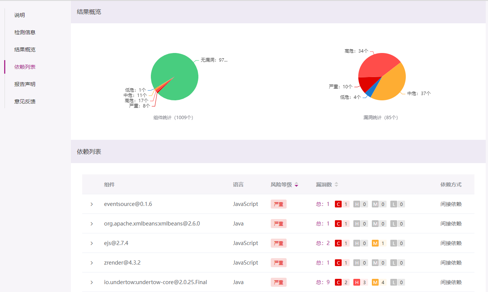

# 快速开始

## 在线检测

[登录](https://opensca.xmirror.cn/login) OpenSCA 控制台，上传项目进行检测

## 本地检测

### 第一步：安装最新版本的OpenSCA-cli

从 [GitHub](https://github.com/XmirrorSecurity/OpenSCA-cli/releases)或 [Gitee](https://gitee.com/XmirrorSecurity/OpenSCA-cli/releases)下载对应系统架构的可执行程序压缩包，并解压到本地任意目录下

### 第二步：开始检测

[登录](https://opensca.xmirror.cn/login) OpenSCA 控制台获取 token，然后进入终端执行检测命令

```shell
opensca-cli -token ${token} -path ${project_path} -out output.html
```

### 第三步：查看检测结果

 `opensca-cli` 所在目录下会生成检测结果文件 `output.html`
 

